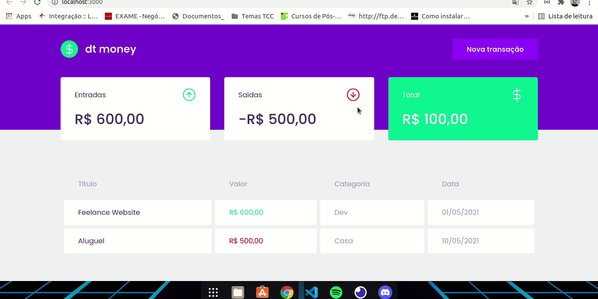

# ReactJS - Chapter II

## dtmoney

Nesse módulo foi construido uma aplicação front-end web completa utilizando conceitos e ferramentas importantes do ecossistema React como Styled Components, MirageJS, Context API, hooks, Axios.

## Front-end

